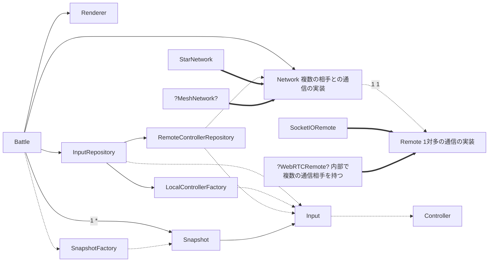

```mermaid
graph LR
    Battle --> Network
    Battle --> Renderer
    Battle --1 *--> Snapshot
    Battle -.-> SnapshotFactory
    Battle --> InputRepository
    InputRepository --> LocalControllerFactory
    InputRepository --> RemoteControllerRepository
    InputRepository -.-> Input
    LocalControllerFactory -.-> Input
    RemoteControllerRepository -.-> Network
    RemoteControllerRepository -.-> Input
    SnapshotFactory -.-> Snapshot
	Input -.-> Controller
    Snapshot --> Input
	Network[Network 複数の相手との通信の実装] -.1 1.-> Remote
	StarNetwork ==> Network
    MeshNetwork[?MeshNetwork?] ==> Network
	Remote[Remote 1対多の通信の実装]
    SocketIORemote ==> Remote
    WebRTCRemote[?WebRTCRemote? 内部で複数の通信相手を持つ] ==> Remote
```
